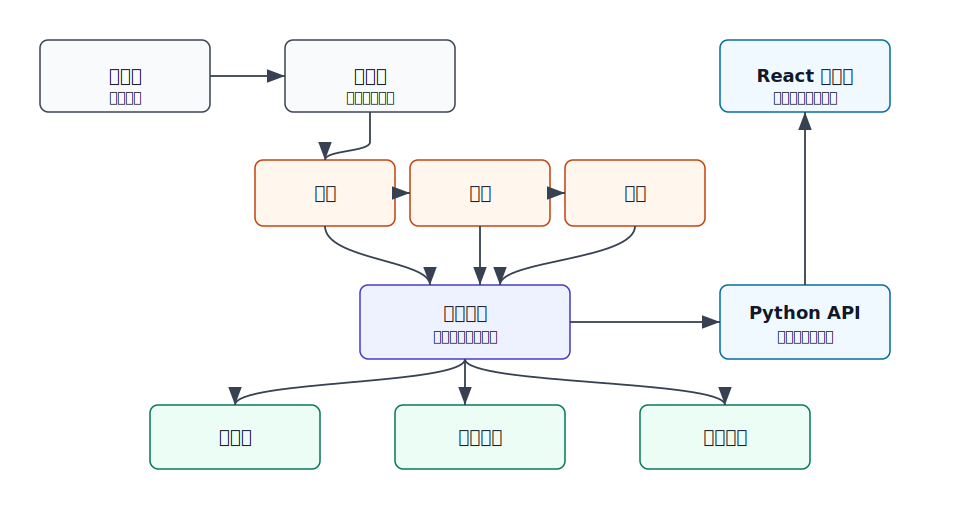

# warvault 设计

warvault 的中文名为 **魔兽资源库**。它面向 Warcraft III / Y3 地图工程，把分散目录里的模型、音效、图片收进一个可检索、可预览、可标注、可由 AI 协助维护的项目数据库。

源资源目录保持只读。warvault 在自己的工作目录内保存数据库、缓存、预览文件、标签和描述，不改名、不移动、不写入源资源文件。

## 目标

warvault 是一个 Python + React 的本地 Web 工具。它管理多个资源源目录，并把三类资源分开处理：

+ **模型**：MDX、MDL，以及转换后的浏览器预览格式。
+ **音效**：WAV、MP3、OGG 等声音文件。
+ **图片**：BLP、DDS、TGA、PNG、JPG、WEBP 等贴图或图标资源。

warvault 负责找到资源、识别类型、建立索引、生成预览缓存、保存标签与描述，并给 AI 批量维护元数据提供审阅队列。它不替代专业模型、音频、图片编辑软件，也不直接产出地图工程导入配置。

## 整体结构

+ **源目录**：用户添加的资源根目录，扫描时只读取文件信息和文件内容。
+ **扫描层**：发现新增、删除、修改和不可访问的文件。
+ **模型 / 音效 / 图片**：三类资源各自拥有识别、元信息读取、预览转换逻辑。
+ **统一索引**：合并三类资源的身份、搜索字段、标签、描述、收藏和错误状态。
+ **数据库**：保存源目录、资源事实、用户维护数据、任务状态和 AI 建议。
+ **预览缓存**：保存缩略图、波形、模型预览文件等可重建文件。
+ **转换记录**：记录转换器、输入特征、输出文件、状态和失败原因。
+ **Python API**：管理任务、搜索、详情、预览文件访问和 AI 建议。
+ **React 工作台**：提供模型库、音效库、图片库、源目录、标签、AI 维护和设置页面。

三类资源的处理代码互相独立，只在统一索引层汇合。替换某一类资源的转换器或预览方案时，不影响另外两类资源。

## 数据边界

项目内数据分成四类：

+ **源资源引用**：源目录身份、相对路径、文件大小、修改时间、可选内容哈希。
+ **资源元数据**：资源类型、格式、尺寸、时长、模型动画、贴图引用、错误状态。
+ **用户维护数据**：标签、描述、备注、收藏、分组、评分、使用状态。
+ **缓存数据**：缩略图、音频波形、模型预览文件、转换日志、失败原因。

资源身份由源目录身份、相对路径、文件特征共同确定。路径是主要展示线索；文件移动后，可用哈希辅助找回历史记录。

用户维护数据只保存在 warvault 数据库中。缓存可以删除后重建，不能因为缓存丢失而丢失标签、描述和收藏状态。

## 数据库

warvault 使用项目内 SQLite 数据库。SQLite 适合本地工具，备份简单，不需要额外服务，也能配合全文搜索管理文件名、路径、标签和描述。

主要数据对象包括：

+ **源目录**：显示名、本地路径、启用状态、资源类型范围、排除规则、最近扫描摘要。
+ **资源记录**：每个被发现的资源文件。
+ **资源版本特征**：大小、修改时间、哈希、扫描时间，用来判断是否需要刷新。
+ **转换记录**：资源经过某个转换器后的结果、状态和错误原因。
+ **标签**：手动标签、规则标签、AI 建议标签分开记录来源。
+ **描述**：用户描述、AI 草稿、已确认描述分开保存。
+ **集合**：用户整理的一组资源，例如 **亡灵建筑套装**、**UI 图标包**。
+ **搜索索引**：文件名、路径、标签、描述、格式和错误信息。

标签支持层级写法，例如 `unit/hero`、`race/undead`、`usage/icon`、`quality/verified`、`state/needs-review`。前期按字符串保存，前端按 `/` 展开显示。

## 源目录

源目录是资源输入的第一层。每个源目录记录显示名、本地路径、启用状态、包含的资源类型、排除规则、最近扫描时间和最近扫描结果摘要。

扫描策略分三种：

+ **首次扫描**：遍历目录，建立索引。
+ **快速刷新**：根据文件大小和修改时间判断变化。
+ **完整刷新**：重新计算哈希，重新读取元信息，并在必要时清理旧缓存。

前端允许添加多个源目录，并按源目录筛选资源。不同地图工程、素材包、下载目录可以并存，不需要整理成同一个物理目录。

## 资源模块

### 模型资源

模型资源识别 Warcraft III 模型文件和贴图引用。支持 MDX、MDL、模型依赖的贴图路径，以及转换后的 Web 预览格式。

模型预览用于快速判断模型外观、贴图是否缺失、是否带动画、尺寸与朝向是否正常、转换是否失败。预览格式建议使用 glTF 或 GLB，前端用 Three.js 展示，并提供旋转、缩放、动画切换、线框和背景色切换。

模型元信息包括原始格式、文件大小、动画列表、材质数量、贴图引用列表、贴图是否可找到、转换状态和预览状态。

### 音效资源

音效资源管理 WAV、MP3、OGG 等声音文件。预览能力包括点击播放、时长显示、波形显示、循环播放、音量控制、按时长筛选和按用途标签筛选。

音频转换器生成浏览器稳定播放的格式，并生成可快速绘制的波形数据。

音效元信息包括格式、时长、采样率、声道数、音量峰值、是否可播放、转换状态和波形缓存状态。

### 图片资源

图片资源管理贴图、图标和 UI 图。支持 BLP、DDS、TGA、PNG、JPG、WEBP。

图片预览提供网格缩略图、单图大图、透明背景检查、棋盘格背景、尺寸显示、主色预览、图标尺寸筛选和贴图路径搜索。

图片转换器生成浏览器可直接显示的 PNG 或 WEBP 缓存。原图保持不变。

图片元信息包括宽高、原始格式、是否有透明通道、主色、文件大小、转换状态和缩略图状态。

## 转换器

转换器是每类资源内部的可替换能力。每个转换器只负责一类输入到一类预览结果：

+ 判断是否支持某种输入格式。
+ 读取原始文件。
+ 生成浏览器可展示的预览文件。
+ 返回元信息。
+ 返回错误原因。
+ 不修改原始文件。

转换器分为识别器、元信息读取器、预览转换器。扫描可以只做识别和轻量元信息读取；预览转换可延后到用户打开资源时执行，也可以在空闲时批量执行。

转换状态包括未转换、等待转换、转换中、已转换、转换失败、源文件已变化且需要重新转换。

## 缓存

缓存放在项目目录内，按资源身份组织，而不是直接按原始路径组织。这样源路径含中文、空格或特殊字符时，缓存路径仍然稳定。

缓存内容包括模型预览文件、图片缩略图、图片 Web 预览图、音频转码文件、音频波形数据、转换日志和错误摘要。

数据库区分资源事实和缓存状态。缓存文件可删除后重建；标签、描述、收藏、AI 审阅状态不依赖缓存文件存在。

## 前端工作台

前端第一屏直接进入资源管理界面，不做营销式首页。主导航包括模型、音效、图片、源目录、标签、AI 维护和设置。

三类资源页面保持相同信息结构：

+ 左侧筛选区。
+ 中间资源列表或网格。
+ 右侧详情面板。
+ 顶部搜索和刷新操作。

模型页面适合卡片与表格混合视图。卡片展示缩略预览，详情面板展示动画、贴图依赖和转换状态。

音效页面适合列表视图。每行包含播放按钮、波形、时长和标签。

图片页面适合网格视图。重点是缩略图密度、透明背景、尺寸筛选和大图预览。

## 搜索与筛选

搜索对象包括文件名、相对路径、源目录名、标签、描述、格式、转换状态和错误信息。

筛选条件包括资源类型、源目录、文件格式、标签、是否有描述、是否收藏、是否转换失败、是否缺少依赖、最近扫描时间、文件大小、图片尺寸、音频时长和模型是否有动画。

后续可加入简单查询语法，例如 `tag:unit race:undead type:model has:preview`。早期版本优先做好可视化筛选和全文搜索。

## 标签与描述

标签和描述是 warvault 的核心价值。每个资源可以有多个标签、一段主描述、多条备注、收藏状态、使用状态、AI 建议字段和人工确认状态。

标签来源分开保存：

+ 手动添加。
+ 规则生成。
+ AI 建议。
+ 导入数据。

AI 建议不直接覆盖人工数据。建议进入待确认状态后，用户批量接受、修改或拒绝；被接受的内容才成为正式标签和描述。

## AI 维护

AI 维护视图围绕批量整理设计。典型任务包括：

+ 给未标注资源生成标签。
+ 根据路径推测资源用途。
+ 为图片生成简短描述。
+ 为音效按用途分类。
+ 找出疑似重复资源。
+ 找出命名相似但标签不同的资源。
+ 找出缺少描述的高频资源。
+ 根据用户选择的标签规则批量补全。

每条 AI 建议至少包含目标资源、建议标签、建议描述、理由摘要、置信度和审阅状态。AI 只维护数据库中的元数据，不修改源文件。

## 后端服务

后端使用 Python Web 服务，FastAPI 是合适选择。后端负责源目录管理、扫描任务、资源识别、转换调用、数据库维护、搜索接口、资源详情、预览文件访问、AI 建议和审阅状态。

扫描、完整刷新、批量转换、AI 批处理属于任务类操作。前端需要看到任务进度、当前文件、成功数量和失败数量。

后端结构包含公共资源索引、公共数据库、公共任务系统、模型模块、音效模块、图片模块、AI 元数据模块和 Web API 层。三类资源不混在一个大模块里。

## 前后端交互

前端不直接访问源目录。它只通过后端获取资源列表、筛选结果、元数据、标签、描述、预览 URL、转换状态、任务进度和 AI 建议。

预览文件由后端提供本地静态访问。这样可以统一权限、缓存路径和错误处理。

## 刷新机制

刷新需要区分发现变化和处理变化。

发现变化包括新增文件、删除文件、修改文件、源目录不可访问和文件格式无法识别。

处理变化包括新资源入库、已删除资源标记为源文件缺失、已修改资源标记为需要重新读取元信息、已修改资源标记为需要重新转换预览，同时保留原有标签和描述。

删除的资源不立即从数据库硬删除，先标记为源文件缺失。外接硬盘、网络盘、临时目录不可用时，用户维护数据不会因此丢失。

## 错误状态

错误状态是资源库的一部分，而不是只写在日志里。常见错误包括源目录不存在、文件无法读取、格式不支持、转换器失败、模型贴图缺失、图片解码失败、音频无法播放、缓存文件丢失和 AI 请求失败。

前端可以按错误筛选资源。用户可以集中处理转换失败的模型、缺贴图的模型或解码失败的图片。

## 配置

项目配置包括数据库位置、缓存目录、源目录列表、转换器开关、任务并发数、缩略图尺寸和 AI 功能开关。

用户偏好包括默认视图、每页数量、最近使用筛选、主题和预览面板布局。

项目配置随项目保存。用户偏好可以保存在浏览器或本地用户配置中。

## 迭代范围

### 资源库骨架

+ 源目录管理。
+ 三类资源扫描。
+ SQLite 数据库。
+ 基础搜索。
+ 标签和描述。
+ 图片基础预览。
+ 音频基础播放。
+ 模型文件信息和转换状态展示。

### 预览能力

+ 图片缩略图缓存。
+ 音频波形。
+ 模型 Web 预览。
+ 转换任务队列。
+ 转换失败筛选。

### 管理效率

+ 批量打标签。
+ 批量编辑描述。
+ 收藏和集合。
+ 重复资源检测。
+ 缺失资源清理。
+ 元数据导入导出。

### AI 维护

+ AI 标签建议。
+ AI 描述建议。
+ 审阅队列。
+ 批量接受和拒绝。
+ 基于规则的自动标注。
+ AI 维护记录。

## 最小可用版本

最小可用版本包含：

+ 添加多个源目录。
+ 扫描模型、音效、图片。
+ 按资源类型查看资源列表。
+ 图片可预览。
+ 音效可播放。
+ 模型可查看基础信息。
+ 每个资源可编辑标签和描述。
+ 按标签、类型、源目录、文件名搜索。
+ 数据库保存在项目内。
+ 不修改任何源目录文件。

这个版本已经能承担资源管理的核心工作。模型转换、AI 批量维护、波形和重复检测可以在后续迭代中逐步加入。
